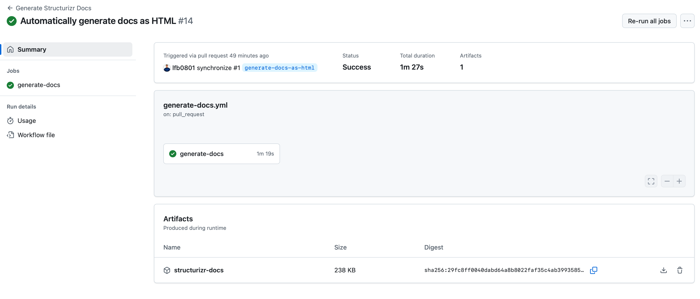

== Docs as Code CI integration

Docs as Code was already introduced in an earlier ADR.
This page continues on that idea, by doing the "hard work", to configure the CI to generate structurizr docs automatically

This allows us to export/deploy the documentation whenever a new PR/MR is created.

=== Design choices:

- We use the same docker-compose from the local-environment (Because consistency is key)
- We then use an export-script (because that is the only way structurizr can generate a PDF output)

=== Surprising performance

The github-action has been configured in such a way that dependencies or plugins are only installed once.

This causes these heavy CI steps to run remarkably fast.

=== github-action configuration
[source,yml]
----
include::.github/workflows/generate-docs.yml[]
----

=== export.js
[,js]
----
include::documentation/export.js[]
----
