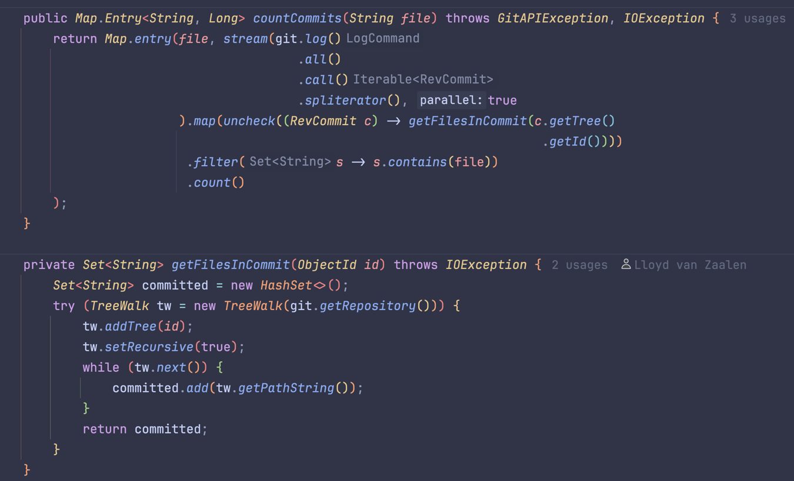

## Overview

In the above image I show the containers that are relevant for my project.
It's important to note that SonarQube is listed as external, but it can also run locally.

> **NOTE** The another notable thing is that the User can technically still commit to the repository, as this is a local
> clone of their codebase. It could become a feature where, when this happens, the analysis is automatically performed
> against the last Tag.

## Implementation

In the following image I show the components that constitute the PQM-Server (Backend of the project).
The most important component in the `PQM-Server`, which is responsible for the analysis of the project, is the
[Scan Aggregator](#Aggregate).

### LOCScanner (LOCC4J)

I am able to make detailed scans over the content of source files.
Thanks to the [LOCC4J](https://github.com/cthing/locc4j) library.
This allows me to ignore blank-lines and comments in my analysis.

Based on the research: [on how many lines of code can a developer maintain](), we learned that it isn't just important
to look at the LoC,
but that we should view churn on modules as an important metric for determining quality.

### GitScanner (JGit)

Thanks to [JGit](https://github.com/eclipse-jgit/jgit?tab=readme-ov-file#java-git) I am able to interact with the VCS of
the given project and analyze the behavior of the developers inside the project.

It also allows me to increase the interval of analysis.
This is important as running my analysis on every build/commit would be expensive and wouldn't align with my research.

The JGit library allows us to create any complex Git-operation. 
Using the following methods we can figure out how often a commit contained the given file.

This would allow us to figure out how often people edit the given file, which is potentially a bad sign.

### SonarQube (Not implemented)

In this project I use a local version of SonarQube, but normally I would expect a company to have already setup their
own SonarQube instance somewhere.

The reason I'm using SonarQube, is to make it do the Static Code Analysis.
This is only a cherry on the cake for my project, as it is mostly concerned the [JGit](#JGit) analysis

### Aggregate

In the aggregate we determine the flow of our application, here we determine the behaviour/interaction with the different scanners.

#### Similar idea to CodeScene

In the image below we see the behavior that CodeScene uses to determine the "code health", which is a similar concept to my quality. In which we can find that they use Clean Code
concepts to explain why a file might be classed as good or bad and then match that against behavioral measurements to come to their healthy or not verdict.

In this project we take a similar approach, but we mostly ignore any Clean Code based measurements and mostly (only) focus on behavioral knowledge. Reasoning for this can be found
in this [ADR](decision/#4)
