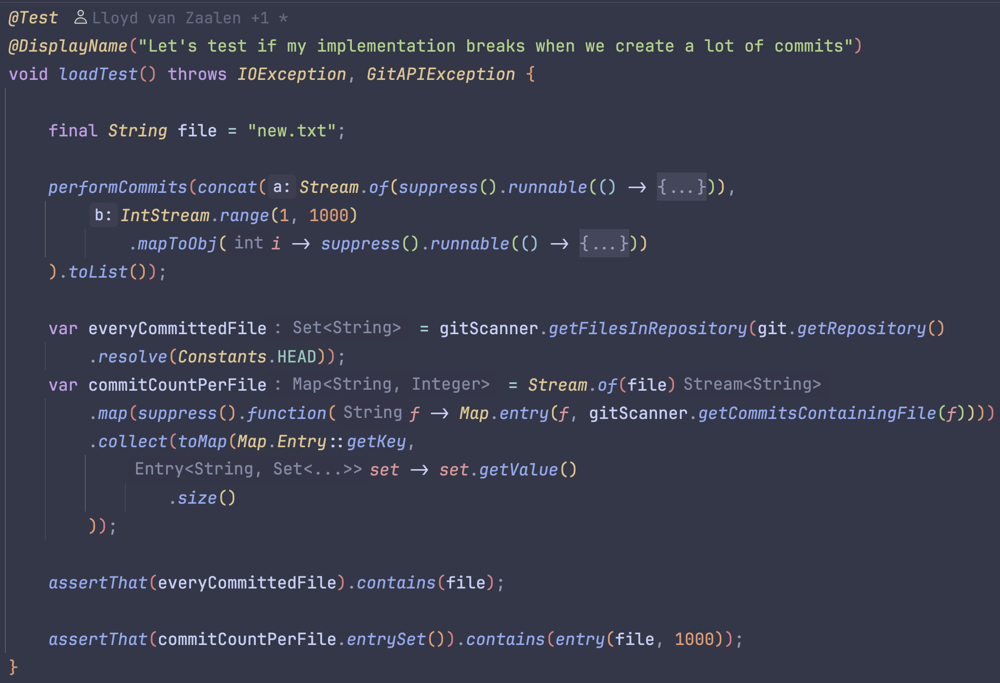
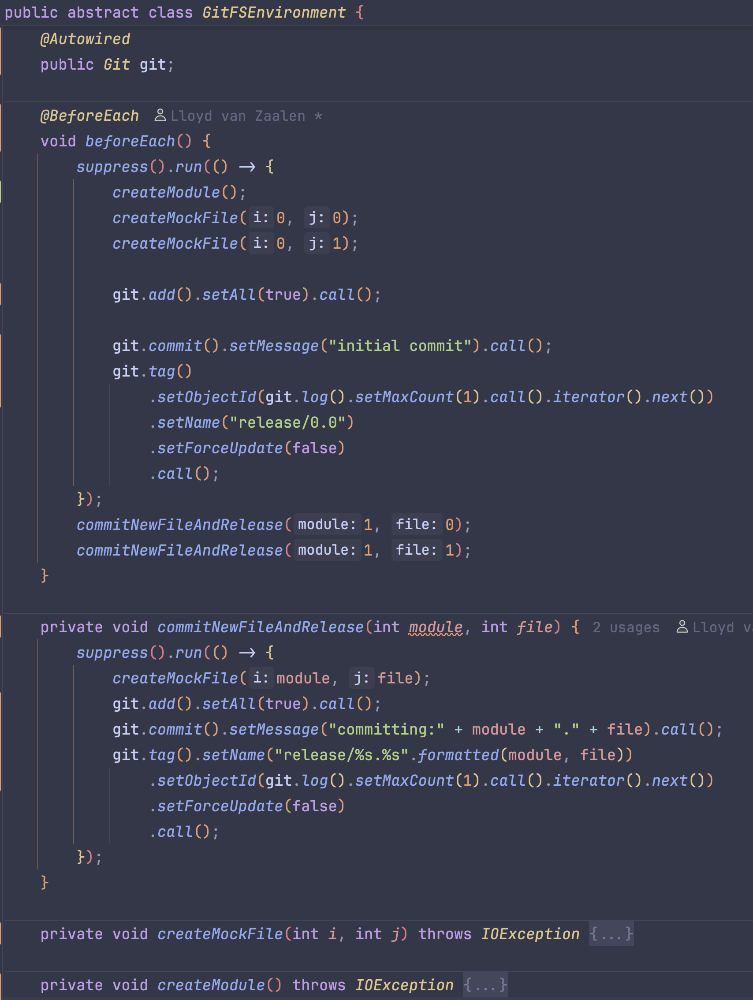

== Test strategie
=== Inleiding

In dit document beschrijven we de strategie voor het uitvoeren van systeemtesten. Deze teststrategie vormt de basis voor de latere stap van testautomatisering bij de uitvoering van de testen.

=== Doelstellingen

* **Verifiëren** dat de analyse-functionaliteit (repository inlezen, commits lezen, LoC berekenen) correct werkt onder diverse omstandigheden.
* **Waarborgen** dat alle systeemgrenzen en belangrijke use-cases afgedekt zijn.
* **Ondersteunen** van continue integratie door tests zo atomair, reproduceerbaar en geautomatiseerd mogelijk te maken.

=== Scope

* **In scope**: de complete flow van repository-initialisatie, commit-iteratie, LoC-meting, en het rapportage‐mechanisme.
* **Out of scope**: GUI-componenten (indien aanwezig), performance-stress-testen, beveiligings-testen.

=== Testniveau en -methoden

==== Testniveau

* **Systeemtesten**: de applicatie als geheel draaien, inclusief Spring Boot-context en JGit-integratie.

==== Testmethoden

* **Functioneel**: validatie van correcte resultaten (aantal bestanden, commits, LoC) bij verschillende repository-structuren.
* **Robuustheid**: foutscenario’s (corrupt repo, ontbrekende permissies, lege repo).
* **Reproduceerbaarheid**: gebruik van virtuele bestanden-systeem om testisolatie te garanderen.

=== Testontwerp & Testdata

==== Virtueel bestanden­systeem

1. **Opzetten**: nieuw virtual-filesystem aanmaken.
2. **Repository initialisatie**: via `Git.init().setDirectory(fs.getPath(…))`.
3. **Commit‐data** aanmaken: bestanden schrijven, `git add`, `git commit`.

==== Testdata sets

* **Klein project**: enkele bestanden met korte inhoud.
* **Groot project**: tientallen bestanden, meerdere commits.
* **Edge cases**: binaire bestanden, lege mappen, geen commits.

=== Testautomatisering

==== Frameworks

* **JUnit 5** voor de testcases.
* **Spring Boot Test** (`@SpringBootTest`) om de volledige context te laden waar nodig.
* **Mockito**/`@MockBean` voor het isoleren van afhankelijkheden (bijv. externe services).

==== CI-integratie

* Voeg teststappen toe aan je pipeline (GitLab CI, Jenkins, GitHub Actions):

  ```yaml
  test:
    stage: test
    script:
      - mvn test -B
  ```
* Zorg dat Jimfs-tests snel (< 1s) blijven; voorkom zware I/O of netwerktoegang.

==== Rapportage & Coverage

* **Surefire Report** (HTML/XML) voor testresultaten.
* **JaCoCo** voor code‐coverage met minimum­drempels (bijv. 80 %).

=== Testomgeving & Infrastructuur


|===
|Omgeving |Configuratie |Doel

|**Lokaal dev**
|Java 21, Maven, virtual file-system
|Ontwikkelaarstest, snelle feedback

|**CI-pijplijn**
|Container JDK 21, Maven, cached dependencies
|Geautomatiseerde end‐to‐end tests
|===

=== Bijlagen

* **Test‐template** (JUnit‐class met voorbeeld).



* **CI-configuratie** (voorbeeld YAML).

[source, yaml]
----
name: Java CI with Maven
on:
  push:
    branches: [ "master" ]
  pull_request:
    branches: [ "master" ]
jobs:
  build:
    runs-on: ubuntu-latest
    steps:
    - uses: actions/checkout@v4
    - name: Set up JDK 21
      uses: actions/setup-java@v4
      with:
        java-version: '21'
        distribution: 'zulu'
        cache: maven
    - name: Build with Maven
      run: mvn clean verify

----

* **Coding standards** voor testcases.


