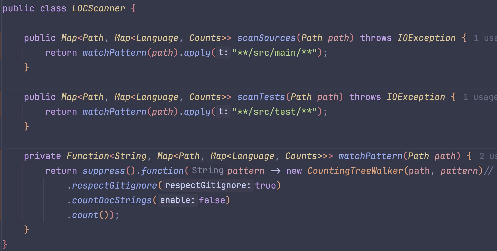
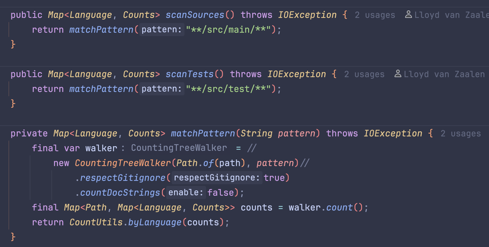

== Zien wij een gezonde churn binnen onze codebase?

=== Requirement

Kunnen we de onderhoudbaarheid van verschillende componenten binnen de code beoordelen, door puur te kijken naar de hoeveelheid code aanwezig in het component.

== Versie #3

In de nieuwe versie van de LoCScanner is er een verandering te zien in de return types van de scan functies. Deze zijn namelijk mee veranderd met de rest van de applicatie sinds we zijn overgestapt van file-based quality metrics, naar project-based.

Zonder deze aanpassing, zouden we voor iedere file in het project deze scan opnieuw uit moeten voeren en vervolgens logica schrijven om deze resultaten vervolgens correct samen te voegen.

Hierdoor behouden we een implementatie die schaalbaar blijft in een steeds veranderende applicatie.

=== Versie #2

Deze nieuwe implementatie is geschreven in Java en heeft de additionele functionaliteit dat er een rekening gehouden kan worden met DocStrings/.gitignore en het verschil tussen source- en test-code

Deze implementatie gaat uit van een gegeven Path, wat dankzij JGit ook automatisch geconfigureerd kan worden op de gegeven Git-tag.

=== Versie #1

Om mijn stakeholder stakeholder snel antwoord te geven op zijn vraag heb ik het volgende bash script opgesteld:

[source,shell]
----
echo "Lines added and removed in the last year"
git log --since=31/12/2021 --numstat --pretty="%H" | awk '
    NF==3 {plus+=$1; minus+=$2;}
    END   {printf("Added: +%d,\n Removed: -%d,\n New: %d\n", plus, minus, plus-minus)}'

echo ""

echo "total lines of code in the application"
cloc .
----

==== resultaat

Na het draaien van de bash script krijgen we het volgende te zien:

[source,text]
----
Lines added and removed in the last year
Added: +4908432,
Removed: -4511570,
New: 396862

total lines of code in the application
   67785 text files.
   32822 unique files.
   45661 files ignored.

github.com/AlDanial/cloc v 2.04  T=120.64 s (272.1 files/s, 58742.2 lines/s)
---------------------------------------------------------------------------------------
Language                             files          blank        comment           code
---------------------------------------------------------------------------------------
XML                                   2867          11505            449        1556922
JavaScript                            8455         191105         315020        1297737
Java                                 12807         217118         750101         821936
CSV                                     90              4              0         354088
JSON                                  1427            387              0         303560
TypeScript                            1180          13082         109382         166827
XSD                                    172            522           1507         148600
HTML                                  1159           4806            325         126981
Markdown                              1121          50594            231         125908
Cucumber                               353           3582            369          79909
C/C++ Header                           454          12422          23088          65393
Web Services Description                51            203              3          40543
YAML                                   175            442            130          39978
CSS                                    177           8005           4832          37488
Kotlin                                 712           8849          24733          35752
Python                                  62           5099           9312          24978
Text                                   407            632              0          18186
XSLT                                   149           1721           1967          16942
Gradle                                 364           2360            287          12453
SVG                                     24              8              5           8939
Properties                             216           1002           1184           6215
C                                        4           1143            153           3460
SQL                                     44            158              2           2806
Bourne Shell                            42            403            384           1863
SCSS                                    56            265             69           1529
diff                                     4            103            305           1186
TOML                                     4             13             31            811
DOS Batch                              106             96             16            781
Perl                                     1             87            170            582
Groovy                                   9             60             43            578
Windows Module Definition                5             83              0            411
CoffeeScript                            10             79             61            410
Maven                                    3             17             11            371
PowerShell                              16             22             78            362
Dockerfile                              33            157             20            297
make                                    26             93             23            268
INI                                     16             53             12            210
Ant                                      2             37             17            187
C#                                       1             55              9            186
PHP                                      1             13             19            124
Bourne Again Shell                       5             27             25            111
PlantUML                                 3             13              0             55
AsciiDoc                                 1              9              0             54
Fish Shell                               1              5             14             21
C++                                      2             12             19             20
Nix                                      1              1              0             19
CMake                                    2              8              0             18
JSP                                      1              0              0             17
Lisp                                     1              0              0              6
---------------------------------------------------------------------------------------
SUM:                                 32822         536460        1244406        5306078
---------------------------------------------------------------------------------------
----

''''

De eerste getallen zouden de hoeveelheid regels moeten zijn die zijn aangepast sinds 31/12/2023.
Dat is iets meer dan 1 jaar geleden, op het moment van meten, wat betekent dat er zo'n grof afgerond 400 duizend regels zijn toegevoegd aan een codebase van 5 miljoen, wat een stuk anders is dan de 15% die we zouden verwachten, op basis van link:/workspace/documentation/research/regels%20code%20per%20developer[regels code per developer]

Dankzij dit resultaat, kon mijn stakeholder snel een beeld vormen over de groei van de code voor de komende 5 jaar.
